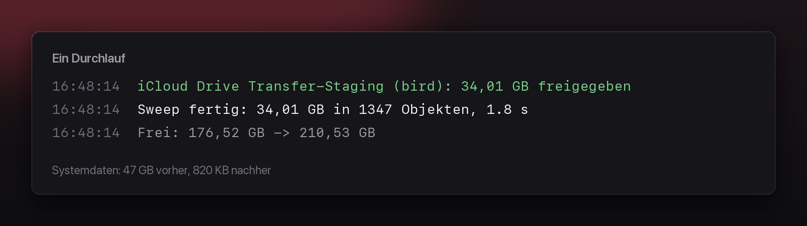

<h1>
  <picture>
    <source media="(prefers-color-scheme: dark)" srcset="./docs/assets/wooosh-mark-dark.png">
    
  </picture>
  &nbsp;Wooosh
</h1>

Wooosh clears the cache that shows up as “System Data” on a Mac and grows there without end. It runs in the background: no window, no menu bar icon, nothing to operate.



## The problem

`bird`, the iCloud Drive service of macOS, stages a copy of every file it
transfers — and does not reliably clear those copies afterwards. They pile up
without a limit in `~/Library/Caches/CloudKit/com.apple.bird`.

On the reference machine that was **47 GB across 1,826 files**, and over 300 GB
in an earlier case. The storage overview files it under “System Data”, which
reads as something you cannot touch.

After the first sweep by Wooosh: **820 KB.**

## Installing

1. Download the current `Wooosh-x.y.z.zip` from [Releases](../../releases)
2. Unpack it and **drag Wooosh.app into your Applications folder**
3. Open it — the window walks you through the one-time permission

On its first start, Wooosh registers itself as a login item. There is no
installer and nothing left behind: dragging Wooosh.app to the bin takes the
autostart with it.

The app is signed with Developer ID and notarised, so it opens on a double
click without a detour through Gatekeeper.

### Full Disk Access

**Without this step, Wooosh does nothing.**

macOS protects `~/Library/Caches/CloudKit` through TCC. Wooosh gets
`EPERM, Operation not permitted` there.

The treacherous part: every higher macOS API reports a TCC block as an *empty
directory*. Without a countermeasure, a blocked app would look exactly like one
that has cleaned up properly. So on an empty match, Wooosh asks `opendir` for
the real `errno` and tells the two cases apart explicitly:

```
[WARN] cloudkit.bird: no matches for ~/Library/Caches/CloudKit/com.apple.bird/*/Assets
       — not readable (Operation not permitted) — Full Disk Access is probably missing
```

When Wooosh sees the block, it shows the setup window and sends a system
notification as well — started from login, there would otherwise be no sign
that the app is only waiting.

Granting it:

1. System Settings → Privacy & Security → **Full Disk Access**
2. “+”, then pick Wooosh from the Applications folder
3. Turn the switch on

**macOS quits Wooosh while you do this.** That is how it works: new permissions
take hold only at the next start. If macOS asks, choose “Quit & Reopen” — if the
app simply disappears instead, open it once more.

If the window is open while access is granted, Wooosh notices within two
seconds and starts right away.

Once granted, the permission survives updates: TCC ties it to the code
signature, and with Developer ID that signature is stable through the team ID.
With an ad-hoc signed app it would be different — there the signature is only
the bundle's CDHash, which changes with every build, so the permission would
lapse every time.

## What gets deleted

Only caches that belong to a **system service**. Anything that belongs to an
application — its cache, its store, its downloaded assets — is off limits, no
matter how easily it could be built again.

| Target | Grace | What |
|---|---|---|
| `cloudkit.bird` | 2 h | iCloud Drive transfer staging by `bird` |
| `iconservices` | 7 d | system-wide icon cache — needs root, therefore off |

### What is never touched

These paths live in a list of their own (`TargetCatalogue.observed`) that the
sweeper does not read. There is no setting that turns one of them into a target.

`~/Library/Application Support/Claude` · `~/Library/Caches/com.openai.codex` ·
`~/Library/Caches/net.whatsapp.WhatsApp` · `~/Library/Caches/*.ShipIt` ·
`~/Library/Developer/Xcode` · `~/Library/Developer/CoreSimulator/Devices` ·
`/Library/Developer/CoreSimulator/Caches` · `~/Library/Caches/ms-playwright` ·
`~/Library/Caches/Homebrew` · `~/Library/Caches/node-gyp` ·
`~/Library/Caches/pip` · `~/Library/Caches/Adobe Camera Raw 2` ·
`~/Library/Caches/Steam` · `~/Library/Mobile Documents` ·
`/private/var/vm/sleepimage` · Bin · Downloads

## How it stays safe

Every deletion passes a gate that works **fail closed**: a check that cannot be
evaluated turns the candidate down instead of waving it through. If `lsof`
cannot be run, the whole sweep is called off.

1. **Allowlist** — a candidate has to sit below a root compiled into the app.
2. **Protected paths** — home, Documents, Desktop, Pictures, Mobile Documents,
   keychains, system directories and their ancestors are barred outright. A
   target that is an ancestor of a protected path is turned down.
3. **Symlinks resolved** — paths are resolved and checked against the allowlist
   *afterwards*.
4. **Volume boundary** — if a child's device ID differs from the container's, it
   is a mount point and is left out.
5. **Grace period** — per target. For directories the whole subtree is searched
   for the youngest timestamp; a folder's own mtime does not move when a
   grandchild changes.
6. **Open handles** — one `lsof` snapshot per sweep. Whatever a process holds
   open, anywhere below a directory, stays where it is.
7. **Containers stay** — only the *children* of a target directory are ever
   deleted, never the directory itself.

That those 47 GB were dead leftovers and not a transfer in progress was
established before any code was written: no write access for hours, no change in
size across a measuring period, zero open handles from `bird` and `cloudd`.
Those very checks are the gate.

## What sets off a sweep

- **Interval** — every 15 minutes, plus once shortly after the start.
- **FSEvents** — a watcher on `~/Library/Caches/CloudKit/com.apple.bird`. The
  first event of a series starts a 90-second clock, later events are collected.

Deliberately a *throttle*, not a resetting debounce: on a busy cache directory
the next write would always arrive before the timer ran out, and the
event-driven sweep would never fire. Protecting a running transfer is the gate's
job anyway, not the schedule's.

## Configuration

Optional. `~/Library/Application Support/Wooosh/config.json`

```json
{
  "enabled": true,
  "dryRun": false,
  "sweepIntervalMinutes": 15,
  "watchDebounceSeconds": 90,
  "maxSweepSeconds": 600,
  "verboseLogging": false,
  "targets": { "cloudkit.bird": { "minimumAgeHours": 6 } }
}
```

Log: `~/Library/Logs/Wooosh/wooosh.log`

## Building

```bash
brew install xcodegen
export DEVELOPMENT_TEAM=XXXXXXXXXX   # Apple Developer → Membership details
cd Wooosh
./build-release.sh
```

The team ID deliberately does not live in the repository, so that a fork cannot
sign with it by accident. `build-release.sh` passes it on to `xcodebuild` and
writes it into a copy of `ExportOptions.plist` under `.build`.

The Xcode project is generated from `project.yml` and is not checked in — new
files never have to be registered by hand. The app icon comes from
`Icon/schild.icon` as an Icon Composer package.

```
Wooosh/
├── Icon/                  schild.icon, schild.png, schild.pxd
└── Wooosh/
    ├── project.yml        project definition for xcodegen
    ├── build-release.sh
    ├── Resources/         Info.plist, icon
    └── Sources/
        ├── Engine/        sweeper, safety gate, targets, configuration
        └── App/           window, access probe, login item, notifications
```

## Distribution

Signed with **Developer ID Application**, hardened runtime on, notarised and
with the ticket stapled. That way the app starts on a double click, offline too,
and permissions once granted survive updates.

`build-release.sh` handles the whole chain: archive, export with Developer ID,
pack, build and sign a disk image, notarise, staple the ticket to app and image,
and print Gatekeeper's verdict.

### Credentials for notarising

Once per machine:

```bash
xcrun notarytool store-credentials "wooosh-notary" \
    --apple-id YOUR@APPLE.ID --team-id $DEVELOPMENT_TEAM
```

That asks for an app-specific password (appleid.apple.com → Sign-In and Security
→ App-Specific Passwords) and keeps it in the keychain. Without the profile the
script still builds a signed app, but skips notarising and says so plainly.

### Two traps on the way to a signature

**Signing happens on export, not on build.** With automatic signing, Xcode
refuses a manually set Developer ID identity (“conflicting provisioning
settings”). So the script archives with automatic signing and lets
`-exportArchive` with `method: developer-id` sign it again.

**The certificate is invisible to `security(1)`.** Xcode keeps automatically
managed identities in the data protection keychain, which the `security` CLI
does not enumerate — `security find-identity` therefore does not show the
Developer ID, although it exists and works. A direct
`codesign -s "Developer ID Application"` does not find it either. Going through
`xcodebuild -exportArchive` is not just more convenient, it is necessary.

## Requirements

macOS 14 or newer. Built and tested on macOS 26.5 with Xcode 26.6.

## Licence

MIT
